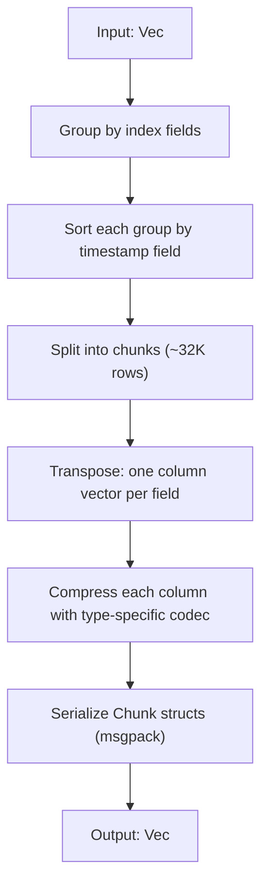
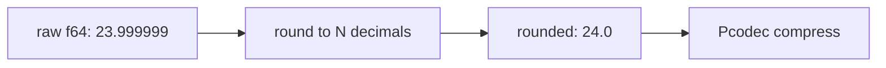
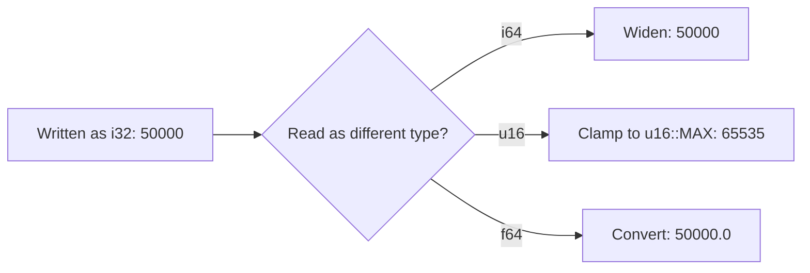

# Contributing

## Running tests

When making changes to the pco_pack crate:

`cargo test --workspace`

When making changes to pco_pack_derive, and debugging compile errors in the proc macro:

`cargo test -p pco_pack_derive && cargo test --test codegen`

## Architecture overview

### Core traits

| Trait | Purpose |
|-------|--------|
| `PcoSerde<T>` | Columnar write/read for a single type. Defines `Writer` and `Reader` associated types.
| `PcoFilter<T>` | Filtering on columnar data. Resolves JSON queries to typed filters, evaluates them against readers.
| `PcoPack<T>` | High-level API: chunking, grouping by index fields, timestamp sorting, serialize/deserialize/filter.

`VecPackable<T>` extends this for `Vec<T>`, enabling nested columnar packing.

### Write path

Filtering deserializes chunks, skips those that don't match index/timestamp bounds, decompresses filter fields first to build a `FilterMask` bitmask, then only decompresses requested fields for matching rows.

### float_round flow

Float rounding is applied before compression to reduce precision noise:

Set via `#[pco_pack(float_round = N)]`. Applied recursively to nested collections but must be explicitly set on nested structs/enums.

### Schema evolution flow

When a numeric field's type changes between write and read versions, coercion happens at read time:

Implemented via the `CoercibleNumber` trait in `number.rs`. Values are clamped to the new type's bounds rather than failing.
